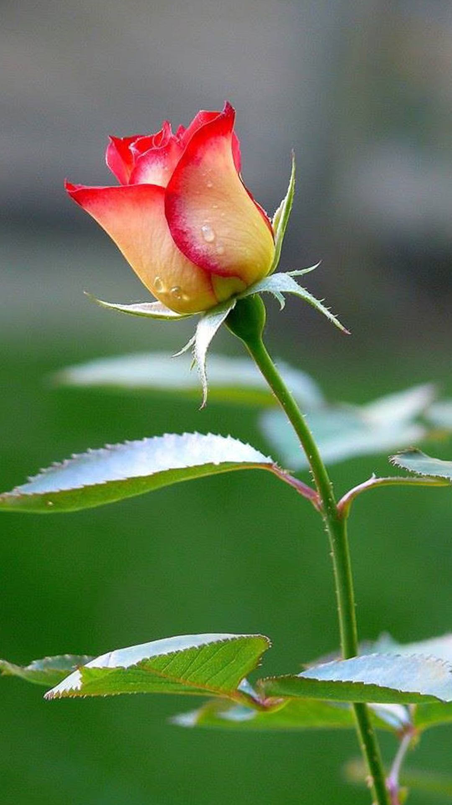

# Image Manipulation via pillow (PIL)

Here are sample programs for image manipulation using `pillow` (PIL - Python Imaging Library)

### Sample Invocation

> python app/main.py -ip input/rose1_example.jpg -op output/rose_flipped.jpg -ro 90 -rsh 100 -rsw 200

### Input Image 1

### Output Image 1

### Input Image 2

### Output Image 2

